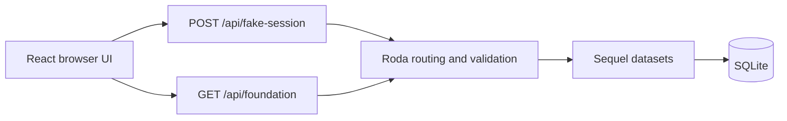
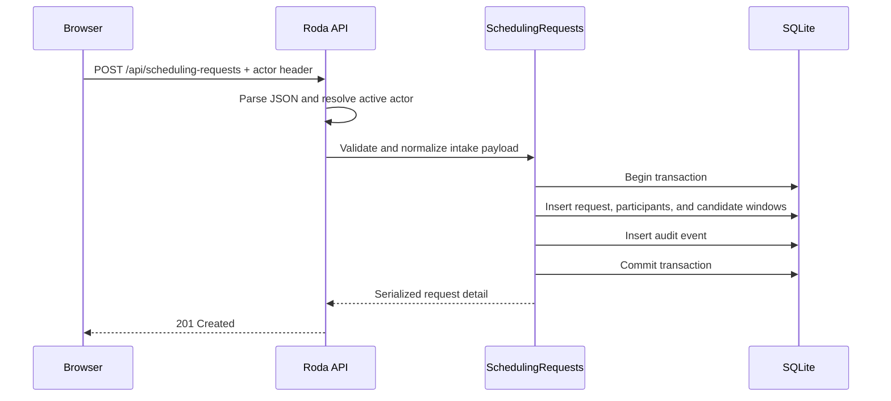
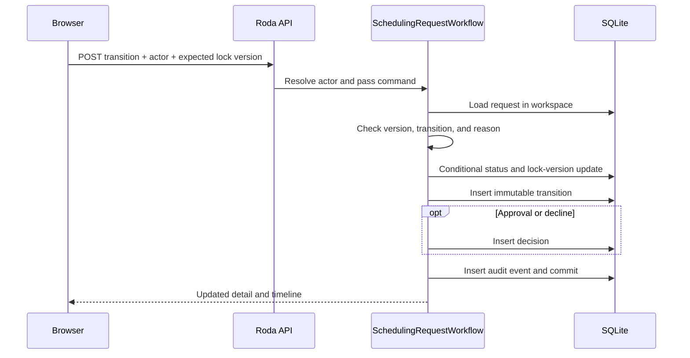
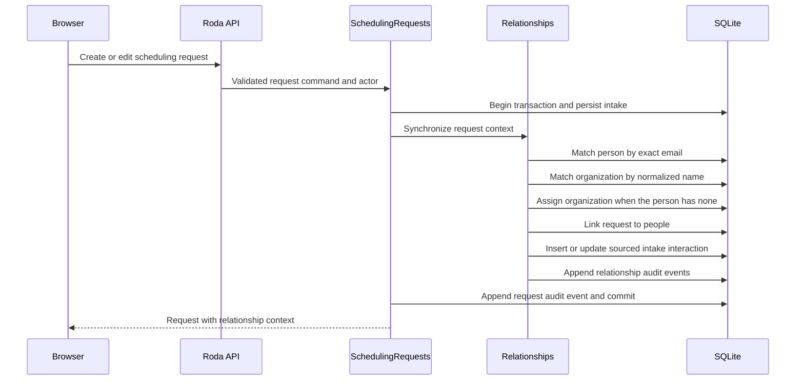
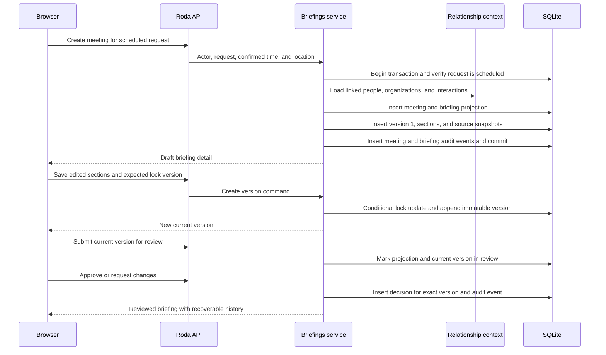
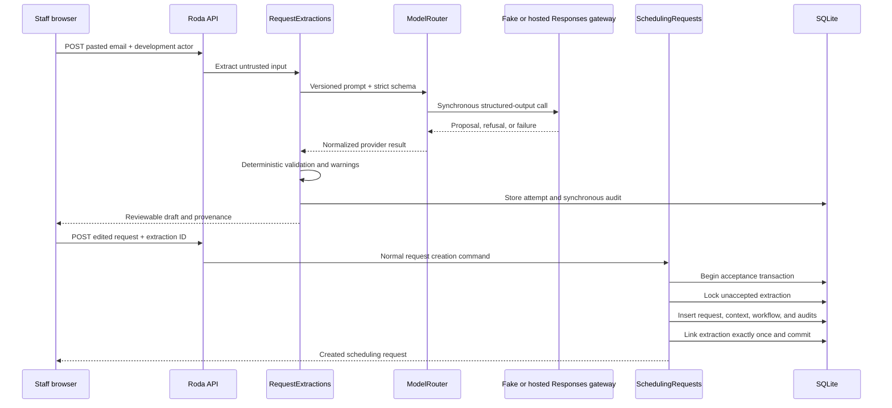

# Holocron Architecture

## Boundaries

The frontend owns presentation and temporary fake-session state. The Ruby API
owns validation, workspace queries, serialization, and database access. Sequel
owns migrations and SQL construction.

## Email Entry Lifecycle

1. The browser submits an email to `POST /api/fake-session`.
2. Roda validates its shape without authenticating it.
3. The API looks for a case-insensitive workspace-member match.
4. A known member receives their seeded name and role; an unknown valid email
   receives a temporary viewer persona.
5. The browser requests `GET /api/foundation` and renders the workspace.

No identity or session record is stored. This is deliberate: authentication is
outside the learning goal for Step 1.

## Framework Decision

Roda was selected over Sinatra because both are small Rack applications, while
Roda's routing tree keeps endpoint matching explicit as the API grows. Sequel is
maintained by the same author and keeps migrations and queries close to SQL.

## Local Database Decision

SQLite keeps the project runnable without a database service. UUID, enum,
case-insensitive email, and JSON values are represented as constrained text.
The logical PostgreSQL types remain documented in the ERD so a future migration
does not need to rediscover the intended model.

## Step 2 Scheduling Request Lifecycle

Reads are workspace-scoped. Writes require the development-only
`X-Holocron-Actor-Email` header, which resolves to an active workspace member.
The route owns HTTP parsing and error responses; `SchedulingRequests` owns the
domain validation, child-record replacement, and transaction boundary.

## Step 3 Workflow Transition Lifecycle

`scheduling_requests.status` is a read-optimized projection. It can change only
through `SchedulingRequestWorkflow`; the transition table is its immutable
explanation. `lock_version` increments on request edits and transitions. A
conditional update affecting zero rows produces `409 Conflict`, and the
transaction writes no transition, decision, or audit event.

## Step 4 Relationship Context Lifecycle

Names alone are not person identifiers. A person is reused automatically only
when an exact case-insensitive email matches within the workspace. Name-only
requesters remain separate unless staff explicitly reconcile them later.
Organizations use a normalized name because their names are less ambiguous in
this initial domain boundary.

A person has zero or one current organization and an optional job title. Intake
may fill an empty organization, but a different organization on an exact-email
match is a validation conflict: the entire request transaction rolls back and
staff must resolve the person explicitly. Interactions retain an author, source
type, and occurrence time.

## Step 5 Manual Briefing Lifecycle

The `briefings` row is the current read projection. Its status, current version
number, and `lock_version` change through domain commands. Section content is
never updated in place: an edit appends a `briefing_versions` row with a complete
new section set. Review status may change on the current version, but its content
and source snapshots remain fixed. Creating a revision after approval moves the
briefing projection back to `draft` while the earlier approved version and
review metadata remain intact. Review fields live directly on the immutable
version, and each section embeds its validated source snapshots as JSON.

Meeting and briefing creation, version writes, review decisions, source
snapshots, and audit events are synchronous transactions. Invalid sources,
invalid workflow states, and stale lock versions roll back every write.

## Step 6 Request Extraction Lifecycle

The pasted text is data, not an instruction channel. The prompt tells the model
to use null instead of guessing, and deterministic code validates structure,
email, dates, times, limits, and participant roles. Missing facts become review
warnings. Malformed output, refusals, provider errors, and exhausted retries are
stored as extraction attempts but never enter scheduling or relationship tables.

`ModelRouter` selects one provider for the request-extraction task. Local and test
runs default to the deterministic fake provider. The recommended hosted path is
Vercel AI Gateway; direct OpenAI and OpenRouter remain alternatives. All three
use the same Responses API adapter. There is no cross-provider fallback: changing
models after a failure would make behavior and evaluation harder to explain at
this stage.

Human acceptance reuses `SchedulingRequests.create`, the sole request-write path.
The service ignores client changes to source provenance and forces `email` plus
the extraction's retained original text. It atomically links the extraction,
creates canonical relationship context, initializes workflow history, and writes
synchronous audit events. A unique link and conditional update prevent replay.
