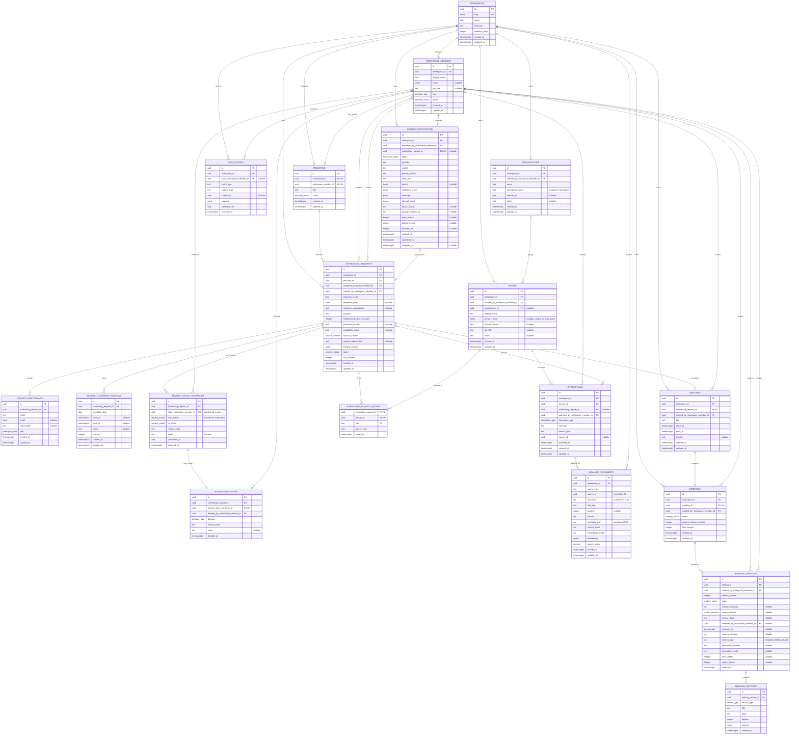

# Step 7 Data Model

The project foundation models one leadership office per workspace. Each workspace
has exactly one principal, represented both as a workspace member and as a
principal domain profile. Scheduling requests are owned by the workspace,
directed to that principal, and retain their structured candidate windows. Each
request is either a `proposed` or `scheduled` meeting, with ordinary audit events
preserving creation and scheduling provenance. Canonical people and organizations
surround those requests. Each person may point to one current organization,
explicit person links preserve each request's context, and interactions retain
source and authorship. Scheduling a proposed request creates one meeting and
briefing in the same transaction. Briefing content is stored in immutable numbered
versions with ordered sections, source snapshots, and per-version review
decisions. Request extraction attempts sit outside the domain-write path until a
staff member accepts one into at most one scheduling request. Grounded generation
reuses the briefing-version model and introduces no mutable generated-content
table: an accepted model response is another immutable draft version.

PostgreSQL stores case-insensitive slugs and emails as `citext`. During the
initial engine migration, UUIDs, enums, and JSON payloads remain application-
validated text even where this logical model shows their intended native
PostgreSQL types. Each briefing section stores an ordered JSON array of validated
source snapshots. Every snapshot contains a source type and ID plus the copied
label and excerpt, so the version remains understandable if the live record
later changes. A version's optional review decision, notes, reviewer, and
timestamp live on the version itself because only one decision is allowed for
each immutable version.

Step 7 expands the permitted source snapshot types to include `meeting` alongside
`scheduling_request`, `person`, `organization`, and `interaction`. Generated
section citations are resolved from temporary `SRC-nnn` manifest handles back to
these snapshots before persistence. Provider, model, prompt/context versions,
usage, retrieval counts, and success or failure are stored in synchronous audit
payloads. Durable model-call records remain a Step 8 concern.

`request_extractions.output` contains the deterministically validated proposal
when extraction succeeds and may retain malformed output for diagnosis when it
fails. Validation errors and warnings remain separate so incomplete but valid
proposals can be reviewed. `scheduling_request_id` and `accepted_at` are both null
until acceptance, then both are set in the scheduling-request transaction. The
unique request link ensures one extraction cannot create multiple requests.
`scheduling_requests.preferred_location` keeps the reviewed meeting location separate
from availability and candidate-window context. `scheduling_requests.briefing_context`
preserves the reviewed v2 intake structure:
agenda items and their evidence excerpts, explicit asks and decisions, owners and
decision-makers, deadlines, readiness standards, dependencies, constraints,
promised deliverables, and unresolved questions. It is stored as application-
validated JSON so existing requests can default to an empty context while the
contract evolves without flattening decision detail back into `purpose`.

Semantic documents are a derived, replaceable index rather than authoritative
domain records. Every interaction has one `overview` unit. Long interactions may
also have selected `burst` units containing independently retrievable decisions,
commitments, concerns, or requests. The composite source/unit key permits multiple
index rows per interaction. Retrieval ranks documents, then collapses them by
`interactions.id` before assigning briefing source references; citations therefore
continue to identify the authoritative interaction even when a child burst supplied
the matching excerpt.
